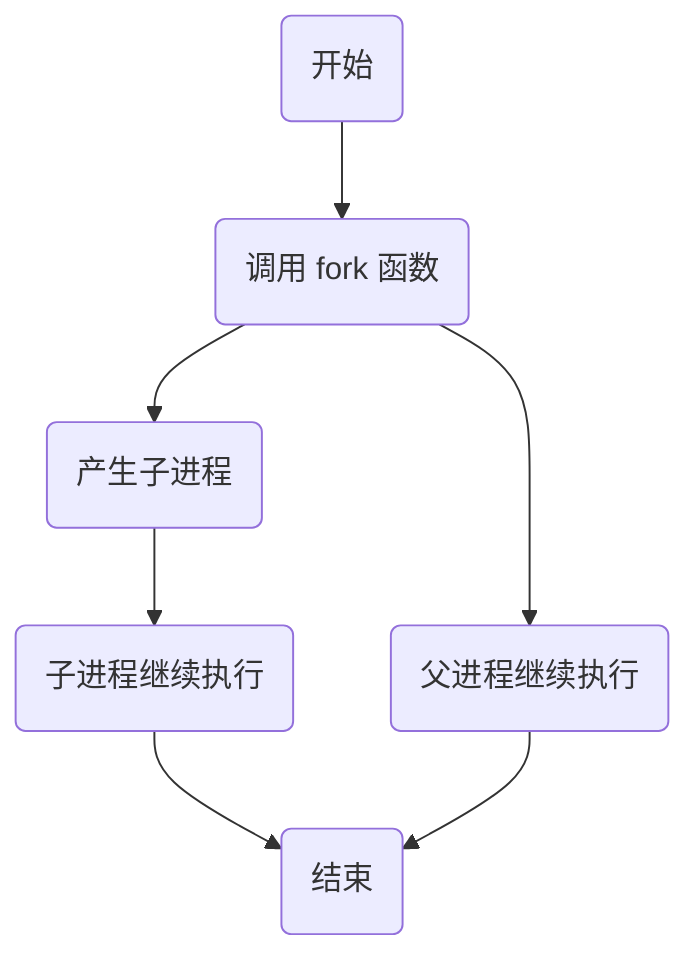

# linux 多进程

## linux 的 0、1、2 号进程

-   `idle`进程：系统创建的第一个进程，加载系统，加载完成之后演变成 1、2 号进程
-   `systemd`是 1 号进程，负责系统初始化，是所有其他用户进程的祖先
-   `kthreadd`是 2 号进程，负责所有内核线程的调度和管理

---

进程标识

-   每个进程都有一个非负整数来表示的唯一进程 ID
-   查看进程：`ps -ef | grep 进程名`
    -   `ps -ef | more` 分页查看，空格下一页
-   1 号和 2 号进程的父进程是 0 号
-   UID：是启动操作进程的用户
-   PID：是进程 ID
-   PPID：是父进程 ID
-   C：CPU 功率
-   STIME：进程的开始时间
-   TTY：启动进程的终端设备
-   TIME：进程运行的总时间
-   CMD：进程执行的对应命令和参数

---

进程标识

-   `getpid(void)`:可以获取进程 ID
-   `getppid(void)`: 可以获取父进程 ID

```c
#include <stdio.h>
#include <stdlib.h>
#include <string.h>
#include <unistd.h>

int main()
{
    printf("getpid() = %d\n", getpid());
    printf("getppid() = %d\n", getppid());

    sleep(50);
}
```

```bash
gcc -o demo demo.c
./demo

getpid() = 2311
getppid() = 1780
```

## fork 函数

-   一个现有的进程调用函数`fork`创建一个新的进程，创建的是一个子进程，原有的是父进程
-   子进程和父进程继续执行`fork`函数后的代码
-   `fork`函数调用一次，返回 2 次
    -   子进程返回 0，父进程返回子进程的进程 ID
    -   子进程是父进程的副本
    -   **子进程获得了父进程的数据空间、堆和栈的副本，不是共享**
    -   父进程中打开的文件描述符也被复制到子进程中

```c
#include <stdio.h>
#include <stdlib.h>
#include <string.h>
#include <unistd.h>

int main()
{
    printf("aaa=%d\n", getpid());
    sleep(10);
    printf("bbb=%d\n", getpid());
    fork();

    printf("ccc=%d\n", getpid());
    sleep(30);
    printf("ddd=%d\n", getpid());
}
```

编译运行

```bash
# c++ 编译运行
g++ -o demo demo.cpp

# c 编译运行
gcc -o demo demo.c

./demo

aaa=2425
bbb=2425
ccc=2425
# 子进程
ccc=2428
# 等待
ddd=2425
ddd=2428
```

---

```c
#include <stdio.h>
#include <stdlib.h>
#include <string.h>
#include <unistd.h>

int main()
{
    printf("aaa=%d\n", getpid());
    sleep(10);
    printf("bbb=%d\n", getpid());
    int pid = fork();
    printf("pid=%d\n",  pid);
    sleep(1);

    printf("ccc=%d\n", getpid());
    sleep(30);
    printf("ddd=%d\n", getpid());
}
```

```bash
[root@VM-16-4-centos src]# gcc -o book book.c
[root@VM-16-4-centos src]# ./book
aaa=8304
bbb=8304
pid=8367
pid=0
ccc=8304
ccc=8367
ddd=8304
ddd=8367
```

可以应征`fork`函数调用一次，返回 2 次，且子进程的事返回 0，父进程返回子进程的进程 ID



由此，我们可以利用`fork`函数，让父进程和子进程执行不同的任务

```c
#include <stdio.h>
#include <stdlib.h>
#include <string.h>
#include <unistd.h>

int main()
{

    int pid = fork();
    printf("pid=%d\n",  pid);
    if (pid == 0)
    {
        printf("这是子进程%d，将执行子进程的任务\n", getpid());
        sleep(20);
    }

    if (pid > 0)
    {
        printf("这是父进程%d, 将执行父进程的任务\n", getpid());
        sleep(30);
    }
}
```

这里给父进程和子进程都加了`sleep`函数，防止父进程执行完，立马退出，导致子进程根本没有机会执行的时间。如果调用失败，会返回`-1`，这种情况一般是系统内存不足，进程太多，系统没有资源，这是比较极端的情况。

```bash
[root@VM-16-4-centos src]# gcc -o book book.c
[root@VM-16-4-centos src]# ./book
pid=12273
这是父进程12271, 将执行父进程的任务
pid=0
这是子进程12273，将执行子进程的任务
```

我么还可以验证是否是副本的效果，我们可以在父进程中定义一个变量，然后在子进程中去修改，然后查看父进程的变量是否被修改

```c
#include <stdio.h>
#include <stdlib.h>
#include <string.h>
#include <unistd.h>

int main()
{
    int ii = 1;
    int pid = fork();
    printf("pid=%d\n",  pid);
    if (pid == 0)
    {
        printf("这是子进程%d，将执行子进程的任务\n", getpid());
        printf("aaa ii=%d\n", ii++); sleep(1);
        printf("aaa ii=%d\n", ii++); sleep(1);
        printf("aaa ii=%d\n", ii++); sleep(1);
        printf("aaa ii=%d\n", ii++); sleep(1);
        printf("aaa ii=%d\n", ii++); sleep(1);
    }

    if (pid > 0)
    {
        printf("这是父进程%d, 将执行父进程的任务\n", getpid());
        printf("bbb ii=%d\n", ii); sleep(1);
        printf("bbb ii=%d\n", ii); sleep(1);
        printf("bbb ii=%d\n", ii); sleep(1);
        printf("bbb ii=%d\n", ii); sleep(1);
        printf("bbb ii=%d\n", ii); sleep(1);
    }
}
```

```bash
[root@VM-16-4-centos src]# ./book
pid=12898
这是父进程12897, 将执行父进程的任务
bbb ii=1
pid=0
这是子进程12898，将执行子进程的任务
aaa ii=1
bbb ii=1
aaa ii=2
bbb ii=1
aaa ii=3
aaa ii=4
bbb ii=1
aaa ii=5
bbb ii=1
```

> 可以看出，子进程修改值之后，并不会影响父进程的值，原因就是子进程里的是父进程里的一个副本。**不是共享**，相当于复制一份，修改复制的那一份数据。

---

验证父进程打开的文件描述符是否复制到子进程中

```c
#include <stdio.h>
#include <stdlib.h>
#include <string.h>
#include <unistd.h>

int main()
{
    FILE *fp = fopen("/tmp/tmp.txt", "w+");
    fprintf(fp, "我要成为优先的程序员\n");
    int ii = 1;
    int pid = fork();
    printf("pid=%d\n",  pid);
    if (pid == 0)
    {
        fprintf(fp, "子进程：我也要成为优先的程序员\n");
        printf("这是子进程%d，将执行子进程的任务\n", getpid());
    }

    if (pid > 0)
    {
        printf("这是父进程%d, 将执行父进程的任务\n", getpid());
        fprintf(fp, "父进程：我要成为优先的程序员\n");
    }

    fclose(fp);
}
```

```bash
[root@VM-16-4-centos src]# gcc -o book book.c
[root@VM-16-4-centos src]# ./book
pid=14214
这是父进程14213, 将执行父进程的任务
pid=0
这是子进程14214，将执行子进程的任务
[root@VM-16-4-centos src]# cat /tmp/tmp.txt
我要成为优先的程序员
父进程：我要成为优先的程序员
我要成为优先的程序员
子进程：我也要成为优先的程序员
```

这里发现：“我要成为优先的程序员” 写了 2 行，看代码本来是要写入 3 行，造成这种原因是因为文件的缓冲区，在`fork`之前往文件里写内容，这一行并没有真正的写到文件里面去，它在缓冲区里，也就是在内存里，下面在`fork`的时候，复制进程的数据空间，包括了文件缓冲区，所以父进程有，子进程中也有，最后在关闭文件的时候，都把各自的缓冲区内容写入到文件；我们可以在`fork`之前先把文件内容刷到硬盘

```c
#include <stdio.h>
#include <stdlib.h>
#include <string.h>
#include <unistd.h>

int main()
{
    FILE *fp = fopen("/tmp/tmp.txt", "w+");
    fprintf(fp, "我要成为优先的程序员\n");
    fflush(fp);

    int pid = fork();
    printf("pid=%d\n",  pid);
    if (pid == 0)
    {
        fprintf(fp, "子进程：我也要成为优先的程序员\n");
        printf("这是子进程%d，将执行子进程的任务\n", getpid());
    }

    if (pid > 0)
    {
        printf("这是父进程%d, 将执行父进程的任务\n", getpid());
        fprintf(fp, "父进程：我要成为优先的程序员\n");
    }

    fclose(fp);
}
```

```bash
[root@VM-16-4-centos src]# gcc -o book book.c
[root@VM-16-4-centos src]# ./book
pid=15477
这是父进程15476, 将执行父进程的任务
pid=0
这是子进程15477，将执行子进程的任务
[root@VM-16-4-centos src]# cat /tmp/tmp.txt
我要成为优先的程序员
父进程：我要成为优先的程序员
子进程：我也要成为优先的程序员
```

**注意：下面 2 行内容输出的顺序是不确定的，取决于操作系统使用的算法**

```c
#include <stdio.h>
#include <stdlib.h>
#include <string.h>
#include <unistd.h>

int main()
{
    FILE *fp = fopen("/tmp/tmp.txt", "w+");
    fprintf(fp, "我要成为优先的程序员\n");
    fflush(fp);

    int pid = fork();
    printf("pid=%d\n",  pid);
    if (pid == 0)
    {
        // 子进程中关闭文件，子进程就写不进去
        fclose(fp);
        fprintf(fp, "子进程：我也要成为优先的程序员\n");
        printf("这是子进程%d，将执行子进程的任务\n", getpid());
    }

    if (pid > 0)
    {
        // 父进程依然可以写
        printf("这是父进程%d, 将执行父进程的任务\n", getpid());
        fprintf(fp, "父进程：我要成为优先的程序员\n");
        fprintf(fp, "父进程：我要成为优先的程序员\n");
        fprintf(fp, "父进程：我要成为优先的程序员\n");
        fclose(fp);
    }
}
```

> 如果在子进程中关闭文件，父进程中有几率第一行是写不了的，但是后面的肯定是可以继续写入文件的。

## 孤儿进程和僵尸进程

> 如果父进程先退出，子进程就会成为孤儿进程

```c
#include <stdio.h>
#include <stdlib.h>
#include <string.h>
#include <unistd.h>

int main()
{
    int pid = fork();
    if (pid == 0)
    {
        printf("这是子进程%d，将执行子进程的任务\n", getpid());
        sleep(10);
    }

    if (pid > 0)
    {
        printf("这是父进程%d, 将执行父进程的任务\n", getpid());
		sleep(5);
    }
}
```

```bash
[root@VM-16-4-centos ~]# ps -ef |  grep book
root     26311  7437  0 17:15 pts/0    00:00:00 ./book
root     26312 26311  0 17:15 pts/0    00:00:00 ./book
root     26317 19449  0 17:15 pts/1    00:00:00 grep --color=auto book
[root@VM-16-4-centos ~]# ps -ef |  grep book
root     26311  7437  0 17:15 pts/0    00:00:00 ./book
root     26312 26311  0 17:15 pts/0    00:00:00 ./book
root     26322 19449  0 17:15 pts/1    00:00:00 grep --color=auto book
[root@VM-16-4-centos ~]# ps -ef |  grep book
root     26311  7437  0 17:15 pts/0    00:00:00 ./book
root     26312 26311  0 17:15 pts/0    00:00:00 ./book
root     26329 19449  0 17:15 pts/1    00:00:00 grep --color=auto book
[root@VM-16-4-centos ~]# ps -ef |  grep book
root     26311  7437  0 17:15 pts/0    00:00:00 ./book
root     26312 26311  0 17:15 pts/0    00:00:00 ./book
root     26331 19449  0 17:15 pts/1    00:00:00 grep --color=auto book
[root@VM-16-4-centos ~]# ps -ef |  grep book
root     26312     1  0 17:15 pts/0    00:00:00 ./book
root     26363 19449  0 17:15 pts/1    00:00:00 grep --color=auto book
```

5 秒后，父进程退出，子进程由 1 号进程收养。最终完成状态收集。

---

```c
#include <stdio.h>
#include <stdlib.h>
#include <string.h>
#include <unistd.h>

int main()
{
    int pid = fork();
    if (pid == 0)
    {
        printf("这是子进程%d，将执行子进程的任务\n", getpid());
        sleep(5);
    }

    if (pid > 0)
    {
        printf("这是父进程%d, 将执行父进程的任务\n", getpid());
		sleep(10);
    }
}
```

```bash
[root@VM-16-4-centos src]# gcc -o book book.c
[root@VM-16-4-centos src]# ./book
这是父进程19828, 将执行父进程的任务
这是子进程19829，将执行子进程的任务
```

查看进程的状态演变

```bash
[root@VM-16-4-centos ~]# ps -ef | grep book
root     19828  7437  0 16:53 pts/0    00:00:00 ./book
root     19829 19828  0 16:53 pts/0    00:00:00 ./book
root     19838 19449  0 16:53 pts/1    00:00:00 grep --color=auto book
[root@VM-16-4-centos ~]# ps -ef | grep book
root     19828  7437  0 16:53 pts/0    00:00:00 ./book
root     19829 19828  0 16:53 pts/0    00:00:00 [book] <defunct>
root     19881 19449  0 16:54 pts/1    00:00:00 grep --color=auto book
[root@VM-16-4-centos ~]# ps -ef | grep book
root     19883 19449  0 16:54 pts/1    00:00:00 grep --color=auto book
```

如果出现`[book] <defunct>`这种，就代表了子进程已经变成了僵尸进程，最后父进程退出之后，僵尸进程也会随之消失。

**僵尸进程**

> 如果子进程先退出，内核向父进程发送`SIGHILD`信号，如果父进程不处理这个信号，子进程就会变成僵尸进程。但是在父进程退出之后，僵尸进程也会消失。

**如果子进程在父进程之前终止，内核为每个字进程保留了一个数据结构，包括进程编号、终止状态和使用 CPU 的时间等。父进程如果处理了子进程退出的信息，内核就会释放这个数据结构，如果父进程没有处理这个子进程退出的信息，内核就不会释放这个数据结构，子进程进程编号就会一直被占用，但是系统可用的进程号是有限的，如果大量的产生僵尸进程，将因为没有可用的进程号而导致系统不能产生新的进程，这就是僵尸进程的危害。**

---

解决僵尸进程的办法:

1.  在父进程中忽略 `SIGHILD`这个信号

```c
#include <stdio.h>
#include <stdlib.h>
#include <string.h>
#include <unistd.h>
#include <signal.h>

int main()
{
    signal(SIGCHILD, SIG_IGN);
    int pid = fork();
    if (pid == 0)
    {
        printf("这是子进程%d，将执行子进程的任务\n", getpid());
        sleep(5);
    }

    if (pid > 0)
    {
        printf("这是父进程%d, 将执行父进程的任务\n", getpid());
		sleep(10);
    }
}
```

这样使用`ps -ef`查看之后就不会出现僵尸进程的显示内容。

2.  在父进程中增加等待子进程退出的代码

    ```c
    #include <stdio.h>
    #include <stdlib.h>
    #include <string.h>
    #include <unistd.h>
    #include <signal.h>

    #include <sys/types.h>
    #include <sys/wait.h>

    int main()
    {
        int pid = fork();
        if (pid == 0)
        {
            printf("这是子进程%d，将执行子进程的任务\n", getpid());
            sleep(5);
        }

        if (pid > 0)
        {
            printf("这是父进程%d, 将执行父进程的任务\n", getpid());
            int sts;
            wait(&sts);
    		sleep(10);
        }
    }
    ```

    ```bash
    [root@VM-16-4-centos ~]# gcc -o book book.c
    [root@VM-16-4-centos ~]# ./book
    这是父进程21291, 将执行父进程的任务
    这是子进程21292，将执行子进程的任务
    ```

    这样也不会产生僵尸进程，但是这样使用`wait`，会在这里等待子进程结束，会阻塞住。

3)  设置子进程的信号处理函数

    ```c
    #include <stdio.h>
    #include <stdlib.h>
    #include <string.h>
    #include <unistd.h>
    #include <signal.h>
    #include <sys/types.h>
    #include <sys/wait.h>

    void func(int sig)
    {
        int sts;
        wait(&sts);
    }

    int main()
    {
        signal(SIGCHLD, func);
        int pid = fork();
        if (pid == 0)
        {
            printf("这是子进程%d，将执行子进程的任务\n", getpid());
            sleep(5);
        }

        if (pid > 0)
        {
            printf("这是父进程%d, 将执行父进程的任务\n", getpid());
    		sleep(10);
        }
    }
    ```

    ```bash
    [root@VM-16-4-centos src]# ./book
    这是父进程22393, 将执行父进程的任务
    这是子进程22394，将执行子进程的任务
    ```

    ```bash
     [root@VM-16-4-centos ~]# ps -ef |  grep book
     root     22862  7437  0 17:04 pts/0    00:00:00 ./book
     root     22863 22862  0 17:04 pts/0    00:00:00 ./book
     root     22900 19449  0 17:04 pts/1    00:00:00 grep --color=auto book
     [root@VM-16-4-centos ~]# ps -ef |  grep book
     root     22862  7437  0 17:04 pts/0    00:00:00 ./book
     root     22863 22862  0 17:04 pts/0    00:00:00 ./book
     root     22903 19449  0 17:04 pts/1    00:00:00 grep --color=auto book
     [root@VM-16-4-centos ~]# ps -ef |  grep book
     root     22862  7437  0 17:04 pts/0    00:00:00 ./book
     root     22863 22862  0 17:04 pts/0    00:00:00 ./book
     root     22905 19449  0 17:04 pts/1    00:00:00 grep --color=auto book
     [root@VM-16-4-centos ~]#
     [root@VM-16-4-centos ~]# ps -ef |  grep book
     root     22912 19449  0 17:04 pts/1    00:00:00 grep --color=auto book
     [root@VM-16-4-centos ~]# ps -ef |  grep book
     root     22914 19449  0 17:04 pts/1    00:00:00 grep --color=auto book
    ```

    > 这样发现 5 秒后 2 个进程都结束了，**子进程 5 秒后结束，内核给父进程发送一个信号，信号是软中断信号，会中断父进程的`sleep`函数的调用，进入到`func`函数之后，程序就退出了**

    ```c
     #include <stdio.h>
    #include <stdlib.h>
    #include <string.h>
    #include <unistd.h>
    #include <signal.h>
    #include <sys/types.h>
    #include <sys/wait.h>

    void func(int sig)
    {
        int sts;
        wait(&sts);
    }

    int main()
    {
        signal(SIGCHLD, func);
        int pid = fork();
        if (pid == 0)
        {
            printf("这是子进程%d，将执行子进程的任务\n", getpid());
            sleep(5);
        }

        if (pid > 0)
        {
            printf("这是父进程%d, 将执行父进程的任务\n", getpid());
    		sleep(10);
            // 再等待 10 秒
            sleep(10);
        }
    }
    ```

    ```bash
    [root@VM-16-4-centos ~]# ps -ef |  grep book
    root     23921  7437  0 17:07 pts/0    00:00:00 ./book
    root     23922 23921  0 17:07 pts/0    00:00:00 ./book
    root     23925 19449  0 17:07 pts/1    00:00:00 grep --color=auto book
    [root@VM-16-4-centos ~]# ps -ef |  grep book
    root     23921  7437  0 17:07 pts/0    00:00:00 ./book
    root     23922 23921  0 17:07 pts/0    00:00:00 ./book
    root     23927 19449  0 17:07 pts/1    00:00:00 grep --color=auto book
    [root@VM-16-4-centos ~]# ps -ef |  grep book
    root     23921  7437  0 17:07 pts/0    00:00:00 ./book
    root     23922 23921  0 17:07 pts/0    00:00:00 ./book
    root     23931 19449  0 17:07 pts/1    00:00:00 grep --color=auto book
    [root@VM-16-4-centos ~]# ps -ef |  grep book
    root     23921  7437  0 17:07 pts/0    00:00:00 ./book
    root     23922 23921  0 17:07 pts/0    00:00:00 ./book
    root     23935 19449  0 17:07 pts/1    00:00:00 grep --color=auto book
    [root@VM-16-4-centos ~]# ps -ef |  grep book
    root     23921  7437  0 17:07 pts/0    00:00:00 ./book
    root     23922 23921  0 17:07 pts/0    00:00:00 ./book
    root     23942 19449  0 17:07 pts/1    00:00:00 grep --color=auto book
    [root@VM-16-4-centos ~]# ps -ef |  grep book
    root     23921  7437  0 17:07 pts/0    00:00:00 ./book
    root     23944 19449  0 17:07 pts/1    00:00:00 grep --color=auto book
    [root@VM-16-4-centos ~]# ps -ef |  grep book
    root     23921  7437  0 17:07 pts/0    00:00:00 ./book
    root     23946 19449  0 17:07 pts/1    00:00:00 grep --color=auto book
    ```

    > 如果父进程先退出，子进程就会成为孤儿进程，将被 1 号进程进行收养，由 1 号进程对他们进行完成状态收集工作
    >
    > 如果子进程先退出，内核向父进程发送`SIGCHLD`信号，如果父进程不处理这个信号，子进程会成为僵尸进程。
