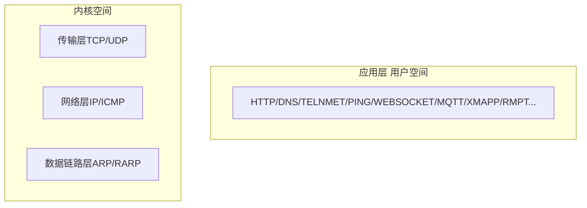

## 概述

> 编写的网络应用程序以`Socket API`来实现，变成语言虽然各不相同，但系统调用 API 完全一致，可以通过`Strace`工具跟踪系统调用。

操作系统以系统调用`Socket API`网络接口提供给引用层的程序。

-   数据链路层/ARP/RAPP：主要完成 IP 地址和物理 MAC 地址转换

    > ARP 请求：数据链路层接收到上层传递进来的数据，首先先拿到 IP，再使用 ARP 程序发起一个请求，它会把对方 IP 和自己的 IP，自己的物理地址 MAC 进行封装，封装后发送出去。

-   网络层 IP、ICMP：主要就是数据的选路和转发
