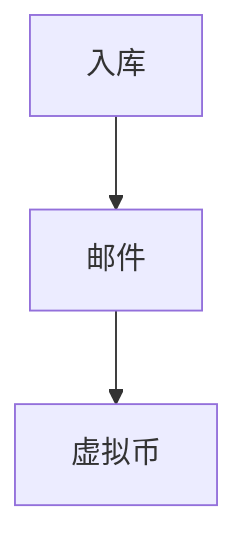
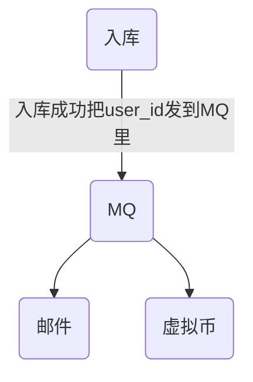
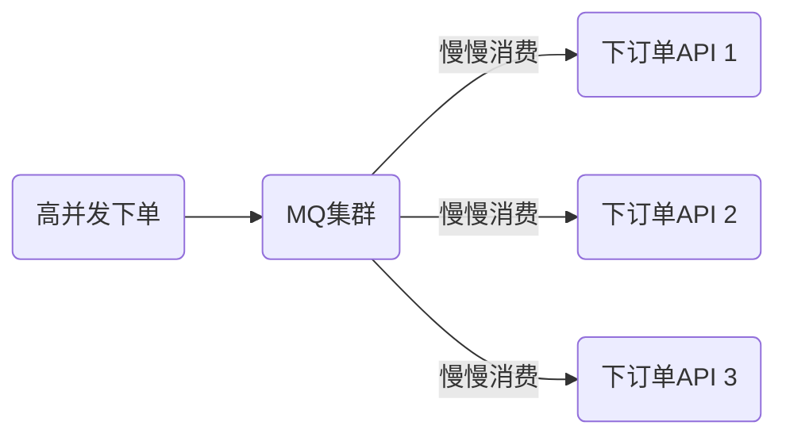

# RabbitMQ 了解

## 为啥要用 MQ

如果项目就几万条数据。1-2 百并发，就增删改查业务

**那么，就不需要 MQ**

<!-- more -->

## 案例

解耦 + 异步

假设有一个用户注册需要以下流程

1.  用户数据入库
2.  发送新人欢迎邮件
3.  赠送新人虚拟币【或积分】

其实只要入库成功就算成功了，下面 2 步完全不需要去等待，如果有 MQ 就可以完成异步。

> 本质上其实入库完就算成功了，于此同时，会有另外的程序去 MQ 里拿到用户 id 去发送邮件和赠送虚拟币的过程。
>
> 所以，基本只有有异步操作，就可以使用 MQ

## 抗压

下订单功能，压力大了之后，对应的下单 API 可能就扛不住了，这个时候可以整一个负载均衡，再假如负载均衡也出现问题，还是会出现压力，然后其实我们可以在一定程度上，可以把下单直接扔给`MQ集群`，最后可以由下单接口消费者慢慢去处理。

## 知识点

1.  就像 HTTP 协议(应用层)一样，浏览器不可能直接裸奔在 TCP 上，所以必须有一个 HTTP 协议来进行互相识别
2.  MQ 也有协议：如`AMQP`，也属于应用层协议
3.  浏览器(`web`服务软件)等都是`HTTP`协议的实现者，那么`RabbitMQ`是`AMQP`的实现者(由`erlang`编写)
