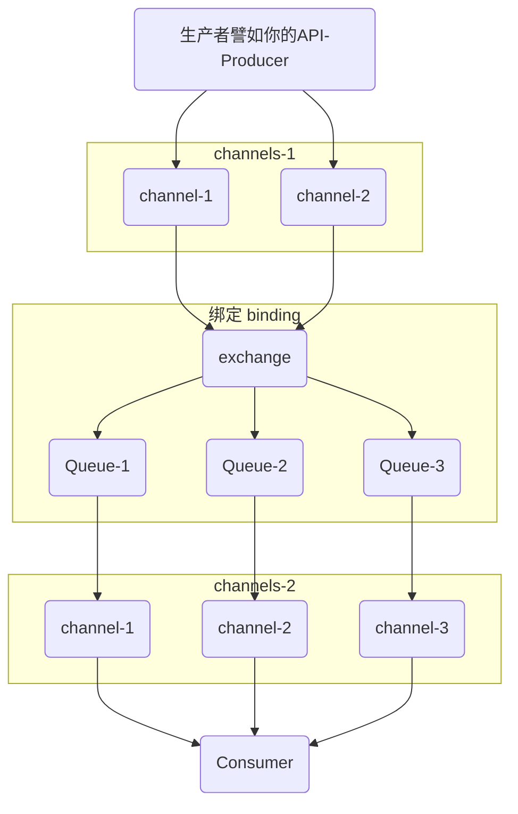

# 快速使用 docker 部署单机 RabbitMQ、Go 客户端

## 使用 docker 部署

`docker`镜像地址：[https://hub.docker.com/\_/rabbitmq](https://hub.docker.com/_/rabbitmq)

通常带有：`DOCKER OFFICIAL IMAGE`的都代表是对应的官方镜像

```bash
docker pull rabbitmq:3.8-management-apline
```

:::tip

`management`代表是有带管理后台的。

最新版

```bash
docker pull rabbitmq:3.11.5-management-alpine
```

:::

### 启动容器

```bash
docker run -d --name rmq \
-e RABBITMQ_DEFAULT_USER=wxviurs \
-e RABBITMQ_DEFAULT_PASS=123 \
-p 8082:15672 \
-p 5672:5672 \
rabbitmq:3.11.5-management-alpine
```

-   15672 是管理端的端口


:::danger 注意

此时如果你有开启什么科学上网，请关闭，否则本地会访问不到

:::


## go 客户端库

GitHub 地址：[https://github.com/streadway/amqp](https://github.com/streadway/amqp)

使用文档：[https://github.com/rabbitmq/rabbitmq-tutorials/tree/main/go](https://github.com/rabbitmq/rabbitmq-tutorials/tree/main/go)

```bash
go get github.com/streadway/amqp
```

`main.go`

```go
package main

import (
	"fmt"
	"github.com/streadway/amqp"
	"log"
)

func main() {
	dsn := fmt.Sprintf("amqp://%s:%s@%s:%d", "wxviurs", "123", "127.0.0.1", 5672)
	conn, err := amqp.Dial(dsn)
	if err != nil {
		log.Fatalln(err)
	}
	defer conn.Close()
}

```

直接运行无报错即可

使用`docker logs rmq`查看日志


代表有客户端进行连接成功

## 简单 demo 草图



1.  生产者创建`channel`发生消息给`ExChange`
2.  `ExChange`（多种交换机）根据策略`binding`队列进行消息投递
3.  队列具有推、拉模式
4.  消费者使用`channel`获取消息，并确认接收或拒绝，重新入列给别的消费者
5.  消费者和生产者都可能有多个
