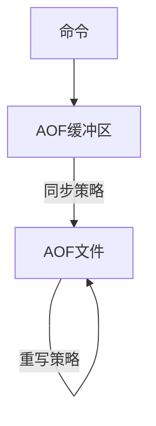

# redis 持久化机制以及缓存过期和淘汰策略

## 持久化

### 模式

-   `rdb`：生成某一时刻的快照，然后保存到二进制文件中
-   `aof`：记录每一条写命令，追加到文件中，打开可以看到具体的操作记录
-   混合模式: 上面 2 种方式的结合

### 触发方式

-   `save`：会让`redis`处于阻塞状态，直到`rdb`持久化完成，线上环境需要谨慎使用

-   `bgsave`，它会`fork`出一个子进程，用来执行持久化，主进程继续响应客户端请求，有短暂的阻塞

-   自动触发：在`m`秒内，有`n`个`key`发生改变，就会触发；执行命令最终执行的是`bgsave`

    ```ini
    # after 900 sec (15 min) if at leaset 1 key changed
    save 900 1
    # after 300 sec (5 min) if at least 10 keys changed
    save 300 10
    # after 60 sec (1 min) if at least 10000 keys changed
    save 60 10000
    ```

### rdb 优缺点

> 优点

-   容灾性好，方便备份
-   性能最大化，`fork`出一个子进程来操作，对主进程没有影响
-   数据比较多的时候，相对于`aof`启动效率比较高

> 缺点

-   会造成数据丢失，因为它是过一段时间触发一次持久化，假如中间发生点故障，会导致这个时间段的数据丢失

### aof 的优缺点




> 同步策略

-   `everysec`：每秒同步一次
-   `always`：每次操作之后都要同步一次
-   `no`：由操作系统调度进行同步

> 重写策略

```bash
set name aaa # 追加一次aof中
set name bbb # 追加一次到aof中
set name ccc # 再次追加

# 最后获取
get name # 得到 ccc 最后一次命令
```

那么中间保存的`aaa`和`bbb`就没有意义了，`aof`在恢复的时候会一条条命令去执行，这样没有意义的占用的空间，所以`redis`就提供了一个重写的策略，当`aof`文件达到了一定大小的时候，就会来执行，把中间的这些过程删掉，只留下最后一条命令，这样`aof`文件就会小很多。

-   手动触发：执行`bgrewriteaof`命令
-   自动触发

`auto-aof-rewrite-percentage`：当前`AOF`文件大小和最后一次重写的大小之间的比率等于或者等于指定的增长百分比，如 100 代表当前的`AOF`文件是上次重写的 2 倍时候才重写

`auto-aof-rewrite-min-size`：当`AOF`文件大小大于该值的时候才可能重写

> 优点

-   数据安全，不会造成数据丢失

> 缺点

-   比`rdb`重启效率低；运行效率比`rdb`低，它是一条条保存的，恢复也是一条条执行的。

## 过期键删除策略

`redis`设置`key`时，都会设置一个过期时间，那么当过期时间到了，`redis`就会同时使用惰性过期和定期过期。

### 惰性过期

只有当这个`key`被访问时，才会判断是否过期，过期则清理掉。它可以节省`cpu`的资源，但是会浪费内存的资源。会出现大量过期的`key`没有被访问过，从而不会被清除，导致内容占用越来越大。

### 定期过期

每间隔一段时间，**扫描一定数量的**设置了过期时间的`key`，假如过期了则删除。

`redis`默认每秒进行 10 次过期扫描

1.  从过期字典中随机 20 个`key`
2.  删除这 20 个`key`中已经过期的
3.  如果超过 25%的`key`过期，则重复第一步；同时，为了保证业务不受影响，`redis`还设置了扫描的时间上限，默认不会超过 25`ms`

## 内存淘汰策略

假如内存不足时，`redis`会根据设置的淘汰策略，删除一些不常用的数据，保证`redis`的正常使用。

配置项：

-   `noeviction`：当内存使用超过配置的时候会返回错误，不会驱逐任何键
-   `allkeys-lru`：加入键的时候，如果过限，首先通过`LRU`算法驱逐最久没有使用的键
-   `volatile-lru`：加入键的时候如果过限，首先从设置了过期的键集合中驱逐最久没有使用的键
-   `allkeys-random`：加入键的时候如果过限，从所有`key`随机删除
-   `volatile-random`：加入键的时候如果过限，从过期键的集合中随机驱逐
-   `volatile-ttl`：从配置了过期时间的键中驱逐马上就要过期的键
-   `volatile-lfu`：从所有配置了过期时间的键中驱逐使用频率最少的键
-   `allkeys-lfu`：从所有键中驱逐使用频率最少的键

### LRU 最近最少使用

根据最近被使用的时间，离当前最远的数据优先被淘汰；

新加入和访问的键会放在队尾，未被使用的和即将淘汰的则会放在队头。

当有了很多个`key`的使用时间在头时，就需要去考虑使用次数的频率来判断谁应该优先淘汰，就产生了`LFU`

### LFU 最不经常使用

最终还是要根据实际业务去选择哪个算法以及什么配置。
