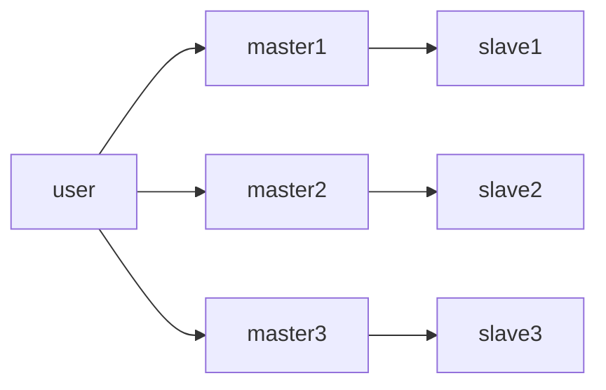
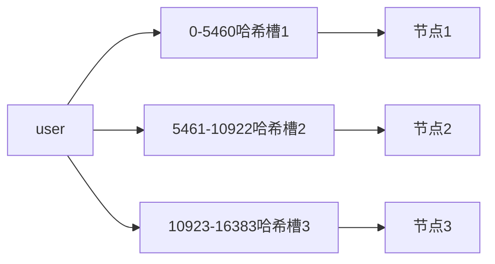
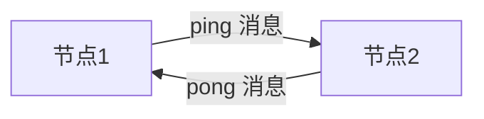
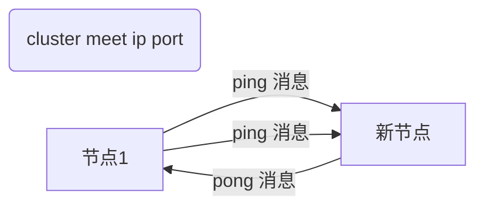
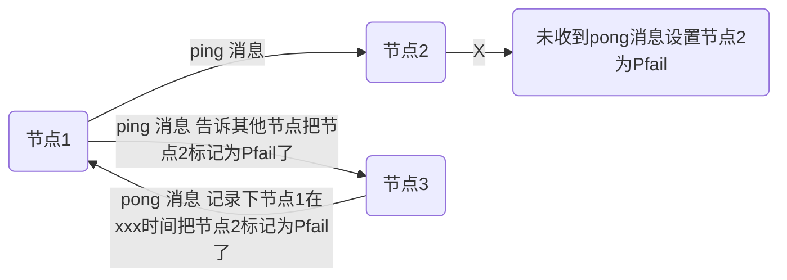
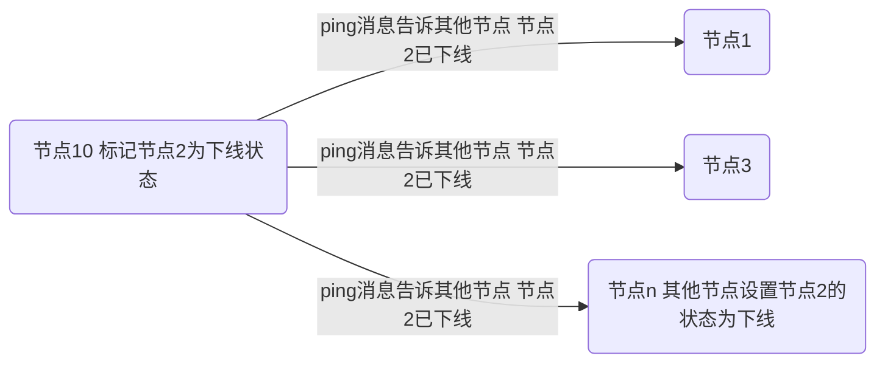
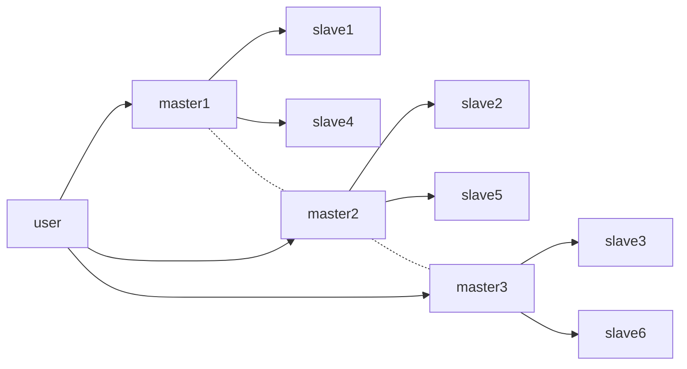

# Redis Cluster 集群

主要是以多主多从的集群方式来保证高可用高并发。

## 特点

-   无中心的结构，数据分散在各个节点上，并且保存了整个集群的状态，每个节点都和其他节点相连
-   官方规定最小需要 6 个节点，3 个主节点和 3 个从节点
-   各个节点是通过`gossip`协议交换数据的，数据分布采用哈希槽算法实现，有一个`crc16(key) % 16384`取模的`redis key`路由公式。

:::tip

`crc16`算法的`hash`值最大是 65535，为什么不创建 65535 个槽位呢？

> `redis`节点发送的心跳包需要把所有的槽位信息放到心跳包中，方便节点知道集群信息；压缩以后大小是 2k；虽然最大 65535 压缩为 8k，作者认为 8k 的心跳包浪费，一般一个 redis 集群也不会超过 1000 个 master 节点，所以 16384 是比较合适的。

:::

## gossip 协议

`Gossip`协议，就像流言蜚语一样，利用一种随机性、带有传染性的方式，将信息传播到整个网络中，并在一定时间内，使得系统内的所有节点数据一致。实现最终一致性。

所有节点都持有一份元数据，不同的节点如果出现了元数据变更以后，就不断的将元数据发送给其他节点，让其他节点也进行元数据的变更。

-   优点：元数据的更新比较分散，没有集中在一个点，更新会陆续的到所有的节点，因为有一定的延时，所以会降低压力。
-   缺点：有延迟性，导致一些操作会滞后

### 通信

每个节点都会维护一份集群的状态

-   当前集群的状态
-   集群中各节点负责的`slots`信息和`migrate`状态
-   集群中各节点的`master`和`slave`状态
-   集群中各节点存货状态和怀疑`Fail`状态

四种命令：

-   MEET：通过`cluster meet ip port`命令，已有集群的节点会向新的节点发送邀请，加入现有集群，然后新节点就会开始与其他节点进行通信
-   PING：节点按照配置的时间间隔向集群中其他节点发送`ping`消息，消息中带有自己的状态，还有自己维护的集群元数据，和部分其他节点的元数据
-   PONG：节点用于回应`PING`和`MEET`的消息，结构和`PING`消息类似 ，也包含自己的状态和其他信息，也可以用于信息广播和更新
-   FAIL：节点`PING`不通某节点后，会向集群所有节点广播该节点挂掉的消息。其他节点收到消息后标记已下线。

## Redis Cluster 集群架构

常用集群架构图

